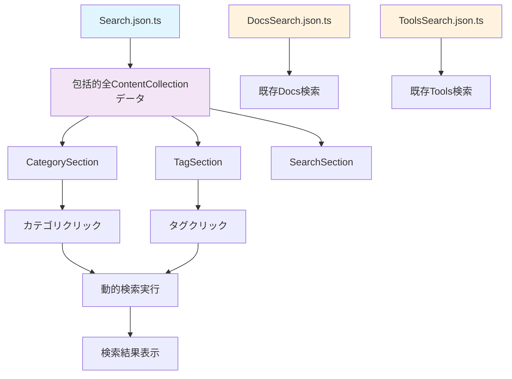

# GoRakuDo 統合検索ページ フロントエンドアーキテクチャ設計

## 概要

本ドキュメントでは、GoRakuDoプロジェクトにおいて、`@tags/`と`@categories/`を統合した検索ページ（`http://localhost:4321/search`）のフロントエンドアーキテクチャ設計について詳述します。

## 要件

1. **統合検索**: `@tags/`と`@categories/`を一箇所で統合
2. **BaseLayout使用**: `@BaseLayout.astro`を基盤としたレイアウト
3. **3層構造**: 上層（カテゴリ閲覧）、中層（タグ表示）、下層（検索バー）
4. **統合エンドポイント**: `Search.json.ts`で`@DocsSearch.json.ts`と`@ToolsSearch.json.ts`を統合
5. **動的検索**: カテゴリ・タグクリック時の自動検索結果表示
6. **モバイルファースト**: レスポンシブデザイン
7. **Astroネイティブ**: スクリプト依存を最小限に
8. **低遅延**: 高速なユーザー体験

## アーキテクチャ設計

### 1. ページ構造

```
/search ページ
├── BaseLayout.astro (基盤レイアウト)
├── 上層: CategorySection (カテゴリ閲覧)
├── 中層: TagSection (タグ表示)
└── 下層: SearchSection (検索バー + 結果表示)
```

### 2. データフロー



### 3. コンポーネント設計

#### 3.1 Search.json.ts (包括的全ContentCollectionエンドポイント)

```typescript
// src/pages/search/Search.json.ts
import { getCollection } from 'astro:content';
import { getVisibleDocs } from '../../utils/content/PostStatus-Filter';
import { getVisibleToolArticles } from '../../utils/content/PostStatus-Filter';
import { resolvePath } from '../../utils/collections';
import { logger } from '../../utils/logging/console-logger';

interface ComprehensiveSearchItem {
  id: string;
  slug: string;
  title: string;
  description: string;
  pubDate: string;
  content: string;
  fullContent: string;
  tags: string[];
  categories: string[];
  type: 'docs' | 'tool-article' | 'page';
  toolName?: string;
  searchableText: string;
  wordCount: number;
  contentLength: number;
  hasCodeBlocks: boolean;
  hasImages: boolean;
  url: string;
  path: string;
  hasContentMatch?: boolean;
}

interface ComprehensiveSearchMetadata {
  totalItems: number;
  docsCount: number;
  toolArticlesCount: number;
  pagesCount: number;
  lastUpdated: string;
  availableCategories: string[];
  availableTags: string[];
  availableTools: string[];
  type: 'comprehensive';
}

interface ComprehensiveSearchResponse {
  metadata: ComprehensiveSearchMetadata;
  data: ComprehensiveSearchItem[];
  filters: {
    category?: string;
    tag?: string;
    tool?: string;
    type?: string;
  };
}

export async function GET({ url }: { url: URL }): Promise<Response> {
  try {
    logger.startGroup('Comprehensive Search Data Generation');
    logger.log('Generating comprehensive search data from all content collections...', 'info');

    // 全コンテンツコレクションを取得（動的読み込み）
    const [allDocs, allToolArticles, allPages] = await Promise.all([
      getCollection('docs'),
      getCollection('tool-articles'),
      getCollection('pages'),
    ]);

    const docs = getVisibleDocs(allDocs);
    const toolArticles = getVisibleToolArticles(allToolArticles);

    logger.log(`Found ${docs.length} docs, ${toolArticles.length} tool articles, ${allPages.length} pages`, 'success');

    // 包括的検索データの生成
    const comprehensiveData: ComprehensiveSearchItem[] = [];

    // Docs データの変換
    docs.forEach(post => {
      const fullContent: string = post.body || '';
      const cleanedContent: string = fullContent
        .replace(/<[^>]*>/g, ' ')
        .replace(/&[^;]+;/g, ' ')
        .replace(/\n+/g, ' ')
        .replace(/\s+/g, ' ')
        .trim();

      comprehensiveData.push({
        id: `docs-${post.slug}`,
        slug: post.slug,
        title: post.data.title,
        description: post.data.description,
        pubDate: post.data.publishedDate,
        content: cleanedContent,
        fullContent: cleanedContent,
        tags: post.data.tags || [],
        categories: post.data.categories || ['general'],
        type: 'docs' as const,
        searchableText: [
          post.data.title,
          post.data.description,
          cleanedContent,
          ...(post.data.tags || []),
          ...(post.data.categories || []),
        ].filter(Boolean).join(' '),
        wordCount: cleanedContent.split(/\s+/).filter(word => word.length > 0).length,
        contentLength: cleanedContent.length,
        hasCodeBlocks: fullContent.includes('```'),
        hasImages: fullContent.includes('!['),
        url: (() => {
          try {
            return resolvePath('docs', post.slug);
          } catch (error) {
            logger.log(`Failed to resolve docs path for ${post.slug}: ${(error as Error).message}`, 'warning');
            return `/docs/${post.slug}`;
          }
        })(),
        path: `docs/${post.slug}`,
      });
    });

    // Tool Articles データの変換
    toolArticles.forEach(article => {
      const fullContent: string = article.body || '';
      const cleanedContent: string = fullContent
        .replace(/<[^>]*>/g, ' ')
        .replace(/&[^;]+;/g, ' ')
        .replace(/\n+/g, ' ')
        .replace(/\s+/g, ' ')
        .trim();

      const toolName: string = article.data.tags?.find(tag => 
        tag && typeof tag === 'string' && /^[a-z]+$/.test(tag)
      ) || 'general';

      comprehensiveData.push({
        id: `tool-${article.slug}`,
        slug: article.slug,
        title: article.data.title,
        description: article.data.description,
        pubDate: article.data.publishedDate,
        content: cleanedContent,
        fullContent: cleanedContent,
        tags: article.data.tags || [],
        categories: ['tools', toolName, ...(article.data.categories || [])],
        type: 'tool-article' as const,
        toolName: toolName,
        searchableText: [
          article.data.title,
          article.data.description,
          cleanedContent,
          ...(article.data.tags || []),
          toolName,
          ...(article.data.categories || []),
        ].filter(Boolean).join(' '),
        wordCount: cleanedContent.split(/\s+/).filter(word => word.length > 0).length,
        contentLength: cleanedContent.length,
        hasCodeBlocks: fullContent.includes('```'),
        hasImages: fullContent.includes('!['),
        url: (() => {
          try {
            return resolvePath('tool-articles', article.slug);
          } catch (error) {
            logger.log(`Failed to resolve tool-articles path for ${article.slug}: ${(error as Error).message}`, 'warning');
            return `/tools/${toolName}/${article.slug}`;
          }
        })(),
        path: `tools/${toolName}/${article.slug}`,
      });
    });

    // Pages データの変換（静的ページ）
    allPages.forEach(page => {
      const fullContent: string = page.body || '';
      const cleanedContent: string = fullContent
        .replace(/<[^>]*>/g, ' ')
        .replace(/&[^;]+;/g, ' ')
        .replace(/\n+/g, ' ')
        .replace(/\s+/g, ' ')
        .trim();

      comprehensiveData.push({
        id: `page-${page.slug}`,
        slug: page.slug,
        title: page.data.title || page.slug,
        description: page.data.description || '',
        pubDate: page.data.publishedDate || new Date().toISOString(),
        content: cleanedContent,
        fullContent: cleanedContent,
        tags: page.data.tags || [],
        categories: page.data.categories || ['pages'],
        type: 'page' as const,
        searchableText: [
          page.data.title || page.slug,
          page.data.description || '',
          cleanedContent,
          ...(page.data.tags || []),
          ...(page.data.categories || []),
        ].filter(Boolean).join(' '),
        wordCount: cleanedContent.split(/\s+/).filter(word => word.length > 0).length,
        contentLength: cleanedContent.length,
        hasCodeBlocks: fullContent.includes('```'),
        hasImages: fullContent.includes('!['),
        url: (() => {
          try {
            return resolvePath('pages', page.slug);
          } catch (error) {
            logger.log(`Failed to resolve pages path for ${page.slug}: ${(error as Error).message}`, 'warning');
            return `/${page.slug}`;
          }
        })(),
        path: page.slug,
      });
    });

    // メタデータの生成
    const metadata: ComprehensiveSearchMetadata = {
      totalItems: comprehensiveData.length,
      docsCount: docs.length,
      toolArticlesCount: toolArticles.length,
      pagesCount: allPages.length,
      lastUpdated: new Date().toISOString(),
      availableCategories: [...new Set(comprehensiveData.flatMap(item => item.categories))],
      availableTags: [...new Set(comprehensiveData.flatMap(item => item.tags))],
      availableTools: [...new Set(comprehensiveData.filter(item => item.type === 'tool-article').map(item => item.toolName!))],
      type: 'comprehensive',
    };

    // クエリパラメータによるフィルタリング
    const searchParams: URLSearchParams = new URLSearchParams(url.search);
    const categoryFilter: string | null = searchParams.get('category');
    const tagFilter: string | null = searchParams.get('tag');
    const toolFilter: string | null = searchParams.get('tool');
    const typeFilter: string | null = searchParams.get('type');

    let filteredData: ComprehensiveSearchItem[] = comprehensiveData;

    // カテゴリフィルタリング
    if (categoryFilter) {
      filteredData = filteredData.filter(item => 
        item.categories.includes(categoryFilter)
      );
    }

    // タグフィルタリング
    if (tagFilter) {
      filteredData = filteredData.filter(item => 
        item.tags.includes(tagFilter)
      );
    }

    // ツールフィルタリング
    if (toolFilter) {
      filteredData = filteredData.filter(item => 
        item.type === 'tool-article' && item.toolName === toolFilter
      );
    }

    // タイプフィルタリング
    if (typeFilter) {
      filteredData = filteredData.filter(item => 
        item.type === typeFilter
      );
    }

    // ログ出力
    logger.log(`Generated comprehensive search data for ${filteredData.length} items (${comprehensiveData.length} total)`, 'success');
    logger.logSummary('Comprehensive Search Data Summary', {
      'Total items': comprehensiveData.length,
      'Filtered items': filteredData.length,
      'Docs items': docs.length,
      'Tool articles': toolArticles.length,
      'Pages': allPages.length,
      'Available categories': metadata.availableCategories.length,
      'Available tags': metadata.availableTags.length,
      'Available tools': metadata.availableTools.length,
    });

    // レスポンス生成
    const responseData: ComprehensiveSearchResponse = {
      metadata,
      data: filteredData,
      filters: {
        category: categoryFilter || undefined,
        tag: tagFilter || undefined,
        tool: toolFilter || undefined,
        type: typeFilter || undefined,
      },
    };

    logger.endGroup();
    return new Response(JSON.stringify(responseData, null, 2), {
      status: 200,
      headers: {
        'Content-Type': 'application/json',
        'Cache-Control': 'public, max-age=1800', // 30分キャッシュ
        'Access-Control-Allow-Origin': '*',
        'Access-Control-Allow-Methods': 'GET',
        'Access-Control-Allow-Headers': 'Content-Type',
      },
    });
  } catch (error) {
    logger.log(`Error generating comprehensive search data: ${(error as Error).message}`, 'error');
    
    return new Response(JSON.stringify({
      error: 'Failed to generate comprehensive search data',
      message: (error as Error).message,
      timestamp: new Date().toISOString(),
    }), {
      status: 500,
      headers: {
        'Content-Type': 'application/json',
      },
    });
  }
}
```

#### 3.2 SearchPage.astro (メインページ)

```astro
---
// src/pages/search.astro
import BaseLayout from '../layouts/BaseLayout.astro';
import CategorySection from '../components/search/CategorySection.astro';
import TagSection from '../components/search/TagSection.astro';
import SearchSection from '../components/search/SearchSection.astro';

// URLパラメータの取得
const { searchParams } = Astro.url;
const initialQuery = searchParams.get('q') || '';
const initialCategory = searchParams.get('category') || '';
const initialTag = searchParams.get('tag') || '';

const seoData = {
  title: 'Search - GoRakuDo',
  description: 'Search through all GoRakuDo content including documentation and tools.',
  keywords: ['search', 'japanese learning', 'immersion', 'tools', 'docs'],
};
---

<BaseLayout
  title={seoData.title}
  description={seoData.description}
  keywords={seoData.keywords}
  pageType='website'
  lang='id'
>
  <main class='search-page'>
    <!-- 上層: カテゴリ閲覧 -->
    <section class='category-section' id='category-section'>
      <CategorySection 
        initialCategory={initialCategory}
        initialQuery={initialQuery}
      />
    </section>

    <!-- 中層: タグ表示 -->
    <section class='tag-section' id='tag-section'>
      <TagSection 
        initialTag={initialTag}
        initialQuery={initialQuery}
      />
    </section>

    <!-- 下層: 検索バー + 結果表示 -->
    <section class='search-section' id='search-section'>
      <SearchSection 
        initialQuery={initialQuery}
        initialCategory={initialCategory}
        initialTag={initialTag}
      />
    </section>
  </main>
</BaseLayout>

<style is:global>
  .search-page {
    min-height: 100vh;
    padding: 1rem;
  }

  .category-section,
  .tag-section,
  .search-section {
    margin-bottom: 2rem;
  }

  /* モバイルファースト */
  @media (max-width: 768px) {
    .search-page {
      padding: 0.5rem;
    }
    
    .category-section,
    .tag-section,
    .search-section {
      margin-bottom: 1.5rem;
    }
  }
</style>
```

#### 3.3 CategorySection.astro

```astro
---
// src/components/search/CategorySection.astro
export interface Props {
  initialCategory?: string;
  initialQuery?: string;
}

const { initialCategory = '', initialQuery = '' } = Astro.props;
---

<section class='category-section'>
  <header class='section-header'>
    <h2 class='section-title'>Browse by Category</h2>
    <p class='section-description'>Click on a category to filter content</p>
  </header>

  <div class='category-grid' id='category-grid'>
    <!-- カテゴリはJavaScriptで動的に読み込み -->
    <div class='loading-indicator'>Loading categories...</div>
  </div>
</section>

<style is:global>
  .category-section {
    padding: 1.5rem 0;
  }

  .section-header {
    text-align: center;
    margin-bottom: 2rem;
  }

  .section-title {
    font-size: 1.875rem;
    font-weight: 700;
    color: var(--clr-text-primary);
    margin-bottom: 0.5rem;
  }

  .section-description {
    color: var(--clr-text-secondary);
    font-size: 1rem;
  }

  .category-grid {
    display: grid;
    grid-template-columns: repeat(auto-fit, minmax(200px, 1fr));
    gap: 1rem;
    max-width: 1200px;
    margin: 0 auto;
  }

  .category-item {
    padding: 1rem;
    border: 1px solid var(--clr-border);
    border-radius: 0.5rem;
    background: var(--clr-background);
    transition: all 0.2s ease;
    cursor: pointer;
    text-decoration: none;
    color: inherit;
  }

  .category-item:hover {
    border-color: var(--clr-purple);
    transform: translateY(-2px);
    box-shadow: 0 4px 12px rgba(0, 0, 0, 0.1);
  }

  .category-name {
    font-weight: 600;
    margin-bottom: 0.25rem;
  }

  .category-count {
    font-size: 0.875rem;
    color: var(--clr-text-secondary);
  }

  .loading-indicator {
    text-align: center;
    color: var(--clr-text-secondary);
    padding: 2rem;
  }

  /* モバイル最適化 */
  @media (max-width: 768px) {
    .category-grid {
      grid-template-columns: 1fr;
      gap: 0.75rem;
    }

    .category-item {
      padding: 0.75rem;
    }

    .section-title {
      font-size: 1.5rem;
    }
  }
</style>

<script>
  // カテゴリデータの動的読み込み（包括的エンドポイントから）
  async function loadCategories() {
    try {
      const response = await fetch('/search/Search.json');
      const data = await response.json();
      
      const categoryGrid = document.getElementById('category-grid');
      if (!categoryGrid) return;

      const categories = data.metadata.availableCategories;
      
      categoryGrid.innerHTML = categories.map(category => `
        <a href="/search?category=${encodeURIComponent(category)}" 
           class="category-item" 
           data-category="${category}">
          <div class="category-name">${category}</div>
          <div class="category-count">Browse content</div>
        </a>
      `).join('');
    } catch (error) {
      console.error('Failed to load categories:', error);
      document.getElementById('category-grid').innerHTML = 
        '<div class="loading-indicator">Failed to load categories</div>';
    }
  }

  // ページ読み込み時にカテゴリを読み込み
  document.addEventListener('DOMContentLoaded', loadCategories);
</script>
```

#### 3.4 TagSection.astro

```astro
---
// src/components/search/TagSection.astro
export interface Props {
  initialTag?: string;
  initialQuery?: string;
}

const { initialTag = '', initialQuery = '' } = Astro.props;
---

<section class='tag-section'>
  <header class='section-header'>
    <h2 class='section-title'>Browse by Tags</h2>
    <p class='section-description'>Click on a tag to filter content</p>
  </header>

  <div class='tag-cloud' id='tag-cloud'>
    <!-- タグはJavaScriptで動的に読み込み -->
    <div class='loading-indicator'>Loading tags...</div>
  </div>
</section>

<style is:global>
  .tag-section {
    padding: 1.5rem 0;
  }

  .tag-cloud {
    display: flex;
    flex-wrap: wrap;
    justify-content: center;
    gap: 0.5rem;
    max-width: 1200px;
    margin: 0 auto;
  }

  .tag-item {
    display: inline-block;
    padding: 0.5rem 1rem;
    background: var(--clr-background-secondary);
    border: 1px solid var(--clr-border);
    border-radius: 1.5rem;
    color: var(--clr-text-primary);
    text-decoration: none;
    font-size: 0.875rem;
    font-weight: 500;
    transition: all 0.2s ease;
  }

  .tag-item:hover {
    background: var(--clr-purple);
    color: white;
    transform: translateY(-1px);
    box-shadow: 0 2px 8px rgba(0, 0, 0, 0.1);
  }

  .tag-item.active {
    background: var(--clr-purple);
    color: white;
  }

  .loading-indicator {
    text-align: center;
    color: var(--clr-text-secondary);
    padding: 2rem;
    width: 100%;
  }

  /* モバイル最適化 */
  @media (max-width: 768px) {
    .tag-cloud {
      gap: 0.25rem;
    }

    .tag-item {
      padding: 0.375rem 0.75rem;
      font-size: 0.8rem;
    }
  }
</style>

<script>
  // タグデータの動的読み込み（包括的エンドポイントから）
  async function loadTags() {
    try {
      const response = await fetch('/search/Search.json');
      const data = await response.json();
      
      const tagCloud = document.getElementById('tag-cloud');
      if (!tagCloud) return;

      const tags = data.metadata.availableTags;
      
      tagCloud.innerHTML = tags.map(tag => `
        <a href="/search?tag=${encodeURIComponent(tag)}" 
           class="tag-item" 
           data-tag="${tag}">
          #${tag}
        </a>
      `).join('');
    } catch (error) {
      console.error('Failed to load tags:', error);
      document.getElementById('tag-cloud').innerHTML = 
        '<div class="loading-indicator">Failed to load tags</div>';
    }
  }

  // ページ読み込み時にタグを読み込み
  document.addEventListener('DOMContentLoaded', loadTags);
</script>
```

#### 3.5 SearchSection.astro

```astro
---
// src/components/search/SearchSection.astro
export interface Props {
  initialQuery?: string;
  initialCategory?: string;
  initialTag?: string;
}

const { initialQuery = '', initialCategory = '', initialTag = '' } = Astro.props;
---

<section class='search-section'>
  <header class='section-header'>
    <h2 class='section-title'>Search Content</h2>
    <p class='section-description'>Search through all GoRakuDo content</p>
  </header>

  <!-- 検索バー -->
  <div class='search-bar-container'>
    <form class='search-form' id='search-form'>
      <div class='search-input-wrapper'>
        <input 
          type='search' 
          id='search-input'
          name='q'
          placeholder='Search documentation and tools...'
          value={initialQuery}
          class='search-input'
          autocomplete='off'
        />
        <button type='submit' class='search-button' aria-label='Search'>
          <svg class='search-icon' fill='none' stroke='currentColor' viewBox='0 0 24 24'>
            <path stroke-linecap='round' stroke-linejoin='round' stroke-width='2' d='M21 21l-6-6m2-5a7 7 0 11-14 0 7 7 0 0114 0z'></path>
          </svg>
        </button>
      </div>
    </form>
  </div>

  <!-- 検索結果 -->
  <div class='search-results' id='search-results'>
    {initialQuery && (
      <div class='search-results-container'>
        <div class='loading-indicator'>Searching...</div>
      </div>
    )}
  </div>
</section>

<style is:global>
  .search-section {
    padding: 1.5rem 0;
  }

  .search-bar-container {
    max-width: 600px;
    margin: 0 auto 2rem auto;
  }

  .search-form {
    width: 100%;
  }

  .search-input-wrapper {
    position: relative;
    display: flex;
    align-items: center;
  }

  .search-input {
    width: 100%;
    padding: 1rem 3rem 1rem 1rem;
    border: 2px solid var(--clr-border);
    border-radius: 0.5rem;
    font-size: 1rem;
    background: var(--clr-background);
    color: var(--clr-text-primary);
    transition: border-color 0.2s ease;
  }

  .search-input:focus {
    outline: none;
    border-color: var(--clr-purple);
    box-shadow: 0 0 0 3px rgba(139, 93, 255, 0.1);
  }

  .search-button {
    position: absolute;
    right: 0.5rem;
    padding: 0.5rem;
    background: var(--clr-purple);
    border: none;
    border-radius: 0.375rem;
    color: white;
    cursor: pointer;
    transition: background-color 0.2s ease;
  }

  .search-button:hover {
    background: var(--clr-accent-dark);
  }

  .search-icon {
    width: 1.25rem;
    height: 1.25rem;
  }

  .search-results {
    max-width: 1200px;
    margin: 0 auto;
  }

  .search-results-container {
    display: grid;
    gap: 1rem;
  }

  .search-result-item {
    padding: 1rem;
    border: 1px solid var(--clr-border);
    border-radius: 0.5rem;
    background: var(--clr-background);
    transition: all 0.2s ease;
  }

  .search-result-item:hover {
    border-color: var(--clr-purple);
    transform: translateY(-1px);
    box-shadow: 0 4px 12px rgba(0, 0, 0, 0.1);
  }

  .result-title {
    font-size: 1.125rem;
    font-weight: 600;
    margin-bottom: 0.5rem;
    color: var(--clr-text-primary);
  }

  .result-description {
    color: var(--clr-text-secondary);
    margin-bottom: 0.75rem;
  }

  .result-meta {
    display: flex;
    justify-content: space-between;
    align-items: center;
    font-size: 0.875rem;
    color: var(--clr-text-secondary);
  }

  .result-type {
    padding: 0.25rem 0.5rem;
    border-radius: 0.25rem;
    font-size: 0.75rem;
    font-weight: 500;
  }

  .result-badge--docs {
    background: var(--clr-success);
    color: white;
  }

  .result-badge--tool {
    background: var(--clr-purple);
    color: white;
  }

  .result-badge--page {
    background: var(--clr-warning);
    color: white;
  }

  .result-path {
    font-family: monospace;
    font-size: 0.75rem;
    color: var(--clr-text-secondary);
  }

  .result-date {
    font-size: 0.75rem;
    color: var(--clr-text-secondary);
  }

  .loading-indicator {
    text-align: center;
    color: var(--clr-text-secondary);
    padding: 2rem;
  }

  /* モバイル最適化 */
  @media (max-width: 768px) {
    .search-input {
      padding: 0.875rem 2.5rem 0.875rem 0.875rem;
      font-size: 0.9rem;
    }

    .search-button {
      right: 0.375rem;
      padding: 0.375rem;
    }

    .search-icon {
      width: 1rem;
      height: 1rem;
    }

    .search-results-container {
      gap: 0.75rem;
    }

    .search-result-item {
      padding: 0.75rem;
    }
  }
</style>

<script>
  import Fuse from 'fuse.js';

  // 検索機能の実装
  class SearchManager {
    constructor() {
      this.data = [];
      this.fuse = null;
      this.initializeSearch();
    }

    async initializeSearch() {
      try {
        // 包括的全ContentCollectionエンドポイントから動的読み込み
        const response = await fetch('/search/Search.json');
        const searchData = await response.json();
        this.data = searchData.data;
        
        // Fuse.jsの設定（包括的検索用）
        this.fuse = new Fuse(this.data, {
          keys: [
            { name: 'title', weight: 0.4 },
            { name: 'description', weight: 0.3 },
            { name: 'content', weight: 0.2 },
            { name: 'tags', weight: 0.1 },
            { name: 'categories', weight: 0.05 },
            { name: 'toolName', weight: 0.05 },
          ],
          threshold: 0.4,
          includeScore: true,
          includeMatches: true,
          minMatchCharLength: 2,
          shouldSort: true,
          findAllMatches: true,
          useExtendedSearch: true,
          ignoreLocation: true,
        });

        // 初期検索クエリがある場合は実行
        const urlParams = new URLSearchParams(window.location.search);
        const initialQuery = urlParams.get('q');
        if (initialQuery) {
          this.performSearch(initialQuery);
        }
      } catch (error) {
        console.error('Failed to initialize comprehensive search:', error);
      }
    }

    performSearch(query) {
      if (!this.fuse || !query.trim()) {
        this.clearResults();
        return;
      }

      const results = this.fuse.search(query);
      this.displayResults(results);
    }

    displayResults(results) {
      const resultsContainer = document.getElementById('search-results');
      if (!resultsContainer) return;

      if (results.length === 0) {
        resultsContainer.innerHTML = `
          <div class='search-results-container'>
            <div class='loading-indicator'>No results found</div>
          </div>
        `;
        return;
      }

      const resultsHTML = results.map((result, index) => {
        const item = result.item;
        const badgeClass = item.type === 'docs' ? 'result-badge--docs' : 
                          item.type === 'tool-article' ? 'result-badge--tool' : 'result-badge--page';
        const badgeText = item.type === 'docs' ? 'Documentation' : 
                         item.type === 'tool-article' ? (item.toolName || 'Tool') : 'Page';
        
        return `
          <a href="${item.url}" class='search-result-item' style="animation-delay: ${index * 50}ms">
            <div class='result-title'>${item.title}</div>
            <div class='result-description'>${item.description}</div>
            <div class='result-meta'>
              <span class='result-type ${badgeClass}'>${badgeText}</span>
              <span class='result-path'>${item.path}</span>
              <span class='result-date'>${new Date(item.pubDate).toLocaleDateString()}</span>
            </div>
          </a>
        `;
      }).join('');

      resultsContainer.innerHTML = `
        <div class='search-results-container'>
          ${resultsHTML}
        </div>
      `;
    }

    clearResults() {
      const resultsContainer = document.getElementById('search-results');
      if (resultsContainer) {
        resultsContainer.innerHTML = '';
      }
    }
  }

  // 検索マネージャーの初期化
  const searchManager = new SearchManager();

  // フォーム送信の処理
  document.getElementById('search-form')?.addEventListener('submit', (e) => {
    e.preventDefault();
    const query = document.getElementById('search-input').value;
    
    // URLを更新
    const url = new URL(window.location);
    url.searchParams.set('q', query);
    window.history.pushState({}, '', url);
    
    // 検索実行
    searchManager.performSearch(query);
  });

  // 入力時のリアルタイム検索（デバウンス付き）
  let searchTimeout;
  document.getElementById('search-input')?.addEventListener('input', (e) => {
    clearTimeout(searchTimeout);
    searchTimeout = setTimeout(() => {
      const query = e.target.value;
      if (query.length >= 2) {
        searchManager.performSearch(query);
      } else {
        searchManager.clearResults();
      }
    }, 300);
  });
</script>
```

## 実装方針

### 1. モバイルファーストアプローチ

- **レスポンシブグリッド**: CSS GridとFlexboxを使用した適応的レイアウト
- **タッチフレンドリー**: 最小44pxのタッチターゲット
- **最適化されたフォントサイズ**: `clamp()`関数を使用した流動的タイポグラフィ
- **モバイル優先のスペーシング**: モバイルでの適切な余白とパディング

### 2. Astroネイティブアプローチ

- **動的読み込み**: 静的生成なし、エンドポイントからの動的データ取得
- **最小限のJavaScript**: 必要な部分のみクライアントサイド処理
- **コンポーネント分離**: 再利用可能なAstroコンポーネント
- **型安全性**: TypeScriptインターフェースの活用

### 3. 低遅延実装

- **包括的データ統合**: 全ContentCollectionを含む単一エンドポイント
- **既存エンドポイント維持**: `@DocsSearch.json.ts`と`@ToolsSearch.json.ts`はそのまま保持
- **キャッシュ戦略**: 適切なHTTPキャッシュヘッダー（30分キャッシュ）
- **最適化された検索**: Fuse.jsによる高速なクライアントサイド検索
- **動的フィルタリング**: クエリパラメータによる柔軟なフィルタリング

## パフォーマンス最適化

### 1. バンドルサイズ最適化

- **Tree Shaking**: 未使用コードの除去
- **動的インポート**: 必要時のみライブラリを読み込み
- **CSS最適化**: 未使用スタイルの除去

### 2. ネットワーク最適化

- **HTTP/2**: 並列リクエストの活用
- **圧縮**: Gzip/Brotli圧縮の適用
- **CDN**: 静的アセットの配信最適化

### 3. レンダリング最適化

- **Critical CSS**: 重要なスタイルの優先読み込み
- **Preload**: 重要なリソースの事前読み込み
- **Lazy Loading**: 画像とコンテンツの遅延読み込み

## セキュリティ考慮事項

### 1. XSS対策

- **DOMPurify**: ユーザー入力のサニタイゼーション
- **CSP**: Content Security Policyの実装
- **入力検証**: クライアント・サーバー両方での検証

### 2. CSRF対策

- **SameSite Cookie**: 適切なCookie設定
- **CSRF Token**: フォーム送信時のトークン検証

## アクセシビリティ

### 1. WCAG準拠

- **キーボードナビゲーション**: 全機能のキーボードアクセス
- **スクリーンリーダー対応**: 適切なARIAラベル
- **色のコントラスト**: 十分なコントラスト比の確保

### 2. ユーザビリティ

- **フォーカス管理**: 明確なフォーカス表示
- **エラーハンドリング**: 分かりやすいエラーメッセージ
- **ローディング状態**: 適切なローディング表示

## テスト戦略

### 1. 単体テスト

- **コンポーネントテスト**: Astroコンポーネントの動作確認
- **ユーティリティテスト**: ヘルパー関数のテスト
- **型テスト**: TypeScriptの型安全性確認

### 2. 統合テスト

- **E2Eテスト**: ユーザーフローの自動テスト
- **パフォーマンステスト**: ページロード時間の測定
- **アクセシビリティテスト**: 自動化されたアクセシビリティチェック

## デプロイメント

### 1. ビルド最適化

- **静的生成**: 全ページの事前生成
- **アセット最適化**: 画像とCSSの最適化
- **バンドル分析**: バンドルサイズの監視

### 2. 環境設定

- **開発環境**: ホットリロードとデバッグ機能
- **ステージング環境**: 本番前の最終確認
- **本番環境**: 最適化されたパフォーマンス設定

## まとめ

本アーキテクチャ設計により、GoRakuDoプロジェクトの統合検索ページは以下の要件を満たします：

1. **包括性**: 全ContentCollection（docs、tool-articles、pages）の統合検索
2. **既存システム維持**: `@DocsSearch.json.ts`と`@ToolsSearch.json.ts`はそのまま保持
3. **動的読み込み**: 静的生成なし、エンドポイントからの動的データ取得
4. **パフォーマンス**: 低遅延での高速検索（30分キャッシュ）
5. **ユーザビリティ**: 直感的な3層構造（カテゴリ・タグ・検索）
6. **保守性**: Astroネイティブな実装
7. **拡張性**: 将来の機能追加に対応

### 主要な変更点

- **Search.json.ts**: 包括的全ContentCollectionエンドポイントとして新規作成
- **既存エンドポイント**: `@DocsSearch.json.ts`と`@ToolsSearch.json.ts`は維持
- **動的読み込み**: 静的生成から動的エンドポイント読み込みに変更
- **包括的検索**: docs、tool-articles、pagesの全コンテンツを統合検索

この設計により、ユーザーは効率的に全コンテンツを発見でき、開発者は既存システムを維持しながら新しい統合検索機能を提供できます。

---

## 実装段階詳細手順

### フェーズ1: 基盤エンドポイントの実装

#### ステップ1.1: Search.json.ts エンドポイントの作成

**ファイル作成**: `src/pages/search/Search.json.ts`

```bash
# ディレクトリ作成
mkdir -p src/pages/search
```

**実装手順**:
1. 上記の`Search.json.ts`コードを実装
2. 依存関係の確認:
   - `src/utils/content/PostStatus-Filter.ts`
   - `src/utils/collections.ts`
   - `src/utils/logging/console-logger.ts`
   - `fuse.js` - 既にインストール済み
   - `dompurify` - 既にインストール済み

**テスト手順**:
```bash
# 開発サーバー起動
npm run dev

# エンドポイントテスト
curl http://localhost:4321/search/Search.json
```

**期待される結果**:
- 200ステータスコード
- JSON形式のレスポンス
- `metadata`と`data`フィールドが存在
- 全ContentCollectionのデータが含まれる

#### ステップ1.2: エンドポイントの動作確認

**確認項目**:
- [ ] docs、tool-articles、pagesの全データが取得できる
- [ ] メタデータ（カテゴリ、タグ、ツール）が正しく生成される
- [ ] クエリパラメータによるフィルタリングが動作する
- [ ] エラーハンドリングが適切に動作する

**デバッグ用コマンド**:
```bash
# カテゴリフィルタリングテスト
curl "http://localhost:4321/search/Search.json?category=tools"

# タグフィルタリングテスト
curl "http://localhost:4321/search/Search.json?tag=javascript"

# タイプフィルタリングテスト
curl "http://localhost:4321/search/Search.json?type=docs"
```

### フェーズ2: 検索ページの基盤実装

#### ステップ2.1: メイン検索ページの作成

**ファイル作成**: `src/pages/search.astro`

**実装手順**:
1. 上記の`SearchPage.astro`コードを実装
2. BaseLayoutの確認とインポート
3. 初期URLパラメータの処理

**テスト手順**:
```bash
# ページアクセステスト
curl http://localhost:4321/search

# クエリパラメータ付きテスト
curl "http://localhost:4321/search?q=test&category=tools"
```

#### ステップ2.2: 基本レイアウトの確認

**確認項目**:
- [ ] BaseLayoutが正しく適用される
- [ ] 3つのセクション（カテゴリ、タグ、検索）が表示される
- [ ] レスポンシブデザインが動作する
- [ ] 初期クエリパラメータが正しく処理される

### フェーズ3: カテゴリセクションの実装

#### ステップ3.1: CategorySectionコンポーネントの作成

**ファイル作成**: `src/components/search/CategorySection.astro`

**実装手順**:
1. 上記の`CategorySection.astro`コードを実装
2. ディレクトリ作成:
```bash
mkdir -p src/components/search
```

**段階的テスト**:
```bash
# 1. コンポーネントの基本表示確認
# ブラウザで http://localhost:4321/search にアクセス

# 2. カテゴリデータの読み込み確認
# ブラウザの開発者ツールでNetworkタブを確認
# /search/Search.json へのリクエストが成功しているか確認

# 3. カテゴリクリックの動作確認
# カテゴリをクリックしてURLが更新されるか確認
```

#### ステップ3.2: カテゴリセクションの動作確認

**確認項目**:
- [ ] カテゴリデータが動的に読み込まれる
- [ ] カテゴリグリッドが正しく表示される
- [ ] カテゴリクリックでURLが更新される
- [ ] ローディング状態が適切に表示される
- [ ] エラー状態が適切に処理される

**デバッグ用JavaScript**:
```javascript
// ブラウザのコンソールで実行
async function testCategoryLoading() {
  try {
    const response = await fetch('/search/Search.json');
    const data = await response.json();
    console.log('Categories:', data.metadata.availableCategories);
    console.log('Total items:', data.metadata.totalItems);
  } catch (error) {
    console.error('Error:', error);
  }
}
testCategoryLoading();
```

### フェーズ4: タグセクションの実装

#### ステップ4.1: TagSectionコンポーネントの作成

**ファイル作成**: `src/components/search/TagSection.astro`

**実装手順**:
1. 上記の`TagSection.astro`コードを実装
2. CategorySectionと同様の構造で実装

**テスト手順**:
```bash
# 1. タグクラウドの表示確認
# ブラウザで http://localhost:4321/search にアクセス

# 2. タグデータの読み込み確認
# 開発者ツールでNetworkタブを確認

# 3. タグクリックの動作確認
# タグをクリックしてURLが更新されるか確認
```

#### ステップ4.2: タグセクションの動作確認

**確認項目**:
- [ ] タグデータが動的に読み込まれる
- [ ] タグクラウドが正しく表示される
- [ ] タグクリックでURLが更新される
- [ ] レスポンシブデザインが動作する
- [ ] タグの色分けが適切に表示される

### フェーズ5: 検索セクションの実装

#### ステップ5.1: SearchSectionコンポーネントの作成

**ファイル作成**: `src/components/search/SearchSection.astro`

**実装手順**:
1. 上記の`SearchSection.astro`コードを実装
2. 既存の依存関係の確認:
   - `fuse.js` - 既にインストール済み
   - `dompurify` - 既にインストール済み

**段階的テスト**:
```bash
# 1. 検索バーの基本表示確認
# ブラウザで http://localhost:4321/search にアクセス

# 2. 検索機能の動作確認
# 検索バーに文字を入力して結果が表示されるか確認

# 3. 初期クエリの処理確認
# http://localhost:4321/search?q=test でアクセスして結果が表示されるか確認
```

#### ステップ5.2: 検索機能の動作確認

**確認項目**:
- [ ] 検索バーが正しく表示される
- [ ] 入力時のリアルタイム検索が動作する
- [ ] 検索結果が適切に表示される
- [ ] 結果のバッジ（docs/tool/page）が正しく表示される
- [ ] 結果クリックで正しいページに遷移する
- [ ] 検索結果がない場合の表示が適切

**デバッグ用JavaScript**:
```javascript
// ブラウザのコンソールで実行
async function testSearchFunctionality() {
  try {
    const response = await fetch('/search/Search.json');
    const data = await response.json();
    console.log('Search data loaded:', data.data.length, 'items');
    
    // Fuse.jsのテスト
    const Fuse = (await import('fuse.js')).default;
    const fuse = new Fuse(data.data, {
      keys: ['title', 'description', 'content', 'tags'],
      threshold: 0.4
    });
    
    const results = fuse.search('test');
    console.log('Search results for "test":', results);
  } catch (error) {
    console.error('Error:', error);
  }
}
testSearchFunctionality();
```

### フェーズ6: 統合テストと最適化

#### ステップ6.1: 統合動作テスト

**テストシナリオ**:
1. **基本検索フロー**:
   - ページアクセス → カテゴリ・タグ読み込み → 検索実行 → 結果表示

2. **カテゴリフィルタリング**:
   - カテゴリクリック → URL更新 → 検索結果フィルタリング

3. **タグフィルタリング**:
   - タグクリック → URL更新 → 検索結果フィルタリング

4. **複合検索**:
   - カテゴリ + タグ + 検索クエリの組み合わせ

**テスト用URL**:
```bash
# 基本検索
http://localhost:4321/search?q=javascript

# カテゴリフィルタ
http://localhost:4321/search?category=tools&q=test

# タグフィルタ
http://localhost:4321/search?tag=react&q=component

# 複合検索
http://localhost:4321/search?category=tools&tag=javascript&q=function
```

#### ステップ6.2: パフォーマンステスト

**テスト項目**:
- [ ] ページロード時間（目標: <2秒）
- [ ] 検索レスポンス時間（目標: <500ms）
- [ ] メモリ使用量の確認
- [ ] ネットワークリクエスト数の最適化

**パフォーマンス測定**:
```javascript
// ブラウザのコンソールで実行
async function performanceTest() {
  const startTime = performance.now();
  
  try {
    const response = await fetch('/search/Search.json');
    const data = await response.json();
    
    const endTime = performance.now();
    console.log(`Data load time: ${endTime - startTime}ms`);
    console.log(`Data size: ${JSON.stringify(data).length} bytes`);
    console.log(`Items count: ${data.data.length}`);
  } catch (error) {
    console.error('Performance test failed:', error);
  }
}
performanceTest();
```

#### ステップ6.3: エラーハンドリングテスト

**テストシナリオ**:
1. **ネットワークエラー**: オフライン状態での動作
2. **無効なクエリ**: 不正なパラメータでの動作
3. **空の結果**: 検索結果がない場合の表示
4. **サーバーエラー**: 500エラー時の動作

**エラーテスト用JavaScript**:
```javascript
// ブラウザのコンソールで実行
async function errorHandlingTest() {
  // 1. 無効なURLテスト
  try {
    await fetch('/search/Search.json?invalid=param');
    console.log('Invalid parameter handled correctly');
  } catch (error) {
    console.log('Error handling test passed:', error.message);
  }
  
  // 2. 存在しないエンドポイントテスト
  try {
    await fetch('/search/NonExistent.json');
  } catch (error) {
    console.log('404 error handled correctly');
  }
}
errorHandlingTest();
```

### フェーズ7: 本番環境準備

#### ステップ7.1: ビルドテスト

**ビルドコマンド**:
```bash
# 本番ビルド
npm run build

# ビルド結果の確認
ls -la dist/

# 静的ファイルの確認
ls -la dist/search/
```

**確認項目**:
- [ ] ビルドが正常に完了する
- [ ] 静的ファイルが正しく生成される
- [ ] エンドポイントが正しく動作する

#### ステップ7.2: 本番環境テスト

**テスト手順**:
```bash
# 本番サーバー起動
npm run preview

# 本番環境でのテスト
curl http://localhost:4321/search/Search.json
```

**確認項目**:
- [ ] 本番環境でエンドポイントが動作する
- [ ] キャッシュヘッダーが正しく設定される
- [ ] パフォーマンスが期待値を満たす

### フェーズ8: ドキュメント化とメンテナンス

#### ステップ8.1: 実装ドキュメントの更新

**更新ファイル**:
- `README.md`: 新機能の説明を追加
- `docs/architecture/front-end-search-architecture.md`: 実装完了の記録
- `docs/api/search-endpoints.md`: エンドポイント仕様書の作成

#### ステップ8.2: メンテナンス計画

**定期メンテナンス項目**:
- [ ] 検索データの更新確認（月次）
- [ ] パフォーマンス監視（週次）
- [ ] エラーログの確認（日次）
- [ ] ユーザーフィードバックの収集（継続）

## 実装チェックリスト

### フェーズ1: 基盤エンドポイント
- [ ] Search.json.ts エンドポイントの実装
- [ ] 既存依存関係の確認（fuse.js、dompurify）
- [ ] エンドポイントの動作テスト
- [ ] エラーハンドリングの実装

### フェーズ2: 検索ページ基盤
- [ ] search.astro ページの実装
- [ ] BaseLayoutの統合
- [ ] URLパラメータの処理
- [ ] 基本レイアウトの確認

### フェーズ3: カテゴリセクション
- [ ] CategorySection.astro の実装
- [ ] 動的データ読み込み
- [ ] カテゴリクリック機能
- [ ] レスポンシブデザイン

### フェーズ4: タグセクション
- [ ] TagSection.astro の実装
- [ ] タグクラウドの表示
- [ ] タグクリック機能
- [ ] 色分けとスタイリング

### フェーズ5: 検索セクション
- [ ] SearchSection.astro の実装
- [ ] Fuse.jsの統合
- [ ] リアルタイム検索
- [ ] 検索結果の表示

### フェーズ6: 統合テスト
- [ ] 全機能の統合テスト
- [ ] パフォーマンステスト
- [ ] エラーハンドリングテスト
- [ ] クロスブラウザテスト

### フェーズ7: 本番準備
- [ ] ビルドテスト
- [ ] 本番環境テスト
- [ ] パフォーマンス最適化
- [ ] セキュリティチェック

### フェーズ8: ドキュメント化
- [ ] 実装ドキュメントの更新
- [ ] API仕様書の作成
- [ ] メンテナンス計画の策定
- [ ] ユーザーガイドの作成

## トラブルシューティング

### よくある問題と解決方法

#### 1. エンドポイントが404エラーを返す
**原因**: ファイルパスまたはルーティングの問題
**解決方法**:
```bash
# ファイルパスの確認
ls -la src/pages/search/

# Astroのルーティング確認
npm run dev
# ブラウザで http://localhost:4321/search/Search.json にアクセス
```

#### 2. 検索データが読み込まれない
**原因**: コンテンツコレクションの設定問題
**解決方法**:
```bash
# コンテンツコレクションの確認
ls -la src/content/

# 設定ファイルの確認
cat src/content/config.ts
```

#### 3. Fuse.jsが動作しない
**原因**: 依存関係の設定問題
**解決方法**:
```bash
# 既存の依存関係の確認
npm list fuse.js dompurify

# ビルドキャッシュのクリア
npm run build -- --force

# 開発サーバーの再起動
npm run dev
```

#### 4. スタイルが適用されない
**原因**: CSS変数またはクラス名の問題
**解決方法**:
```bash
# グローバルCSSの確認
cat src/styles/global.css

# ブラウザの開発者ツールでCSSの確認
```

## 実装完了後の確認事項

### 機能確認
- [ ] 全ContentCollectionの検索が動作する
- [ ] カテゴリ・タグフィルタリングが動作する
- [ ] リアルタイム検索が動作する
- [ ] レスポンシブデザインが動作する
- [ ] エラーハンドリングが適切に動作する

### パフォーマンス確認
- [ ] ページロード時間 < 2秒
- [ ] 検索レスポンス時間 < 500ms
- [ ] メモリ使用量が適切
- [ ] ネットワークリクエストが最適化されている

### セキュリティ確認
- [ ] XSS対策が実装されている
- [ ] 入力検証が適切に行われている
- [ ] エラーメッセージに機密情報が含まれていない

この実装段階詳細手順に従って、段階的に統合検索機能を実装していくことで、安定した高品質なシステムを構築できます。
